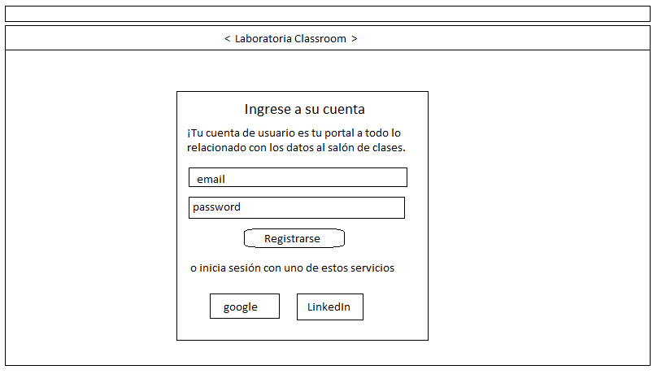
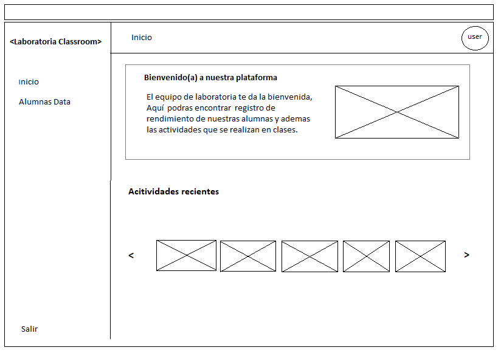
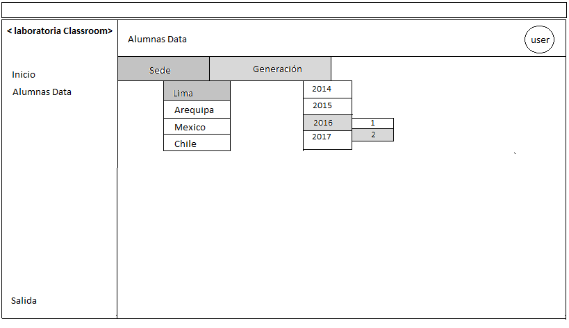
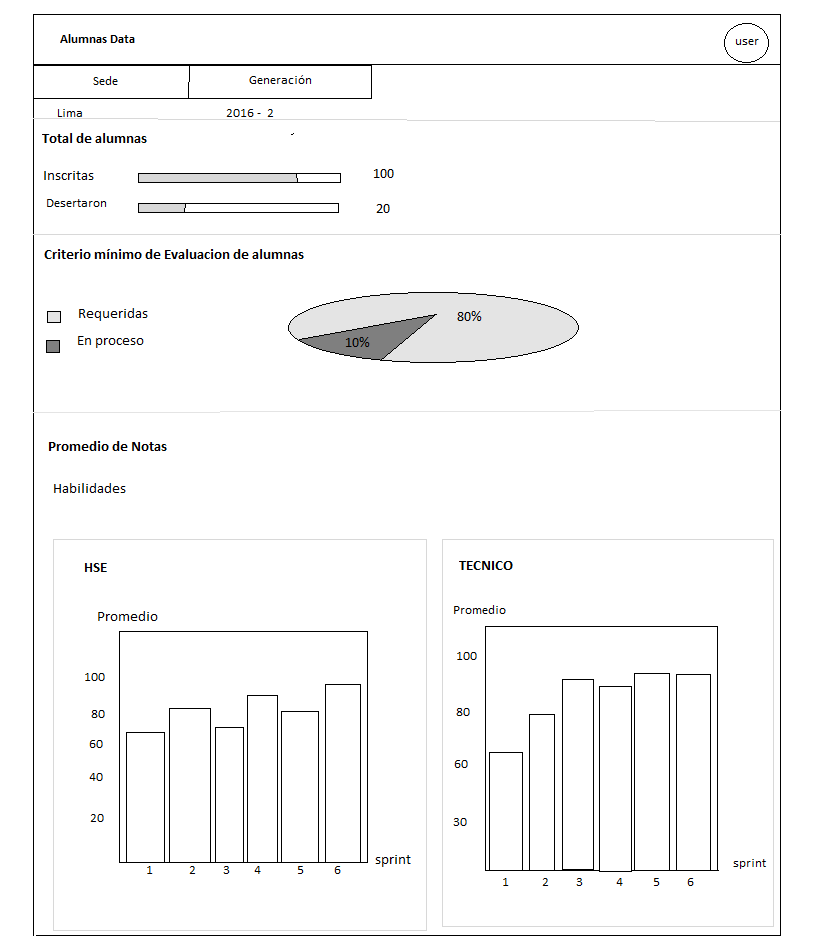

## Sketch  dashboard de Laboratoria

 > Dashboard es la herramienta utilizada por profesores, training managers, directores y gerentes de Laboratoria para ver rápidamente qué está pasando en el salón de clases de Laboratoria. En el dashboard, los usuarios pueden ver rápidamente estadísticas y datos en tiempo real.

Este sketch se realizo con la finalidad de como los usuarios podrian simular la pagina  y tambien en como se podria ver nuestra pagina en un tiempo corto y asi mejorar la experiencia del usuario.

#### Parte 1

#### Parte 2

#### Parte 3

#### Parte 4

